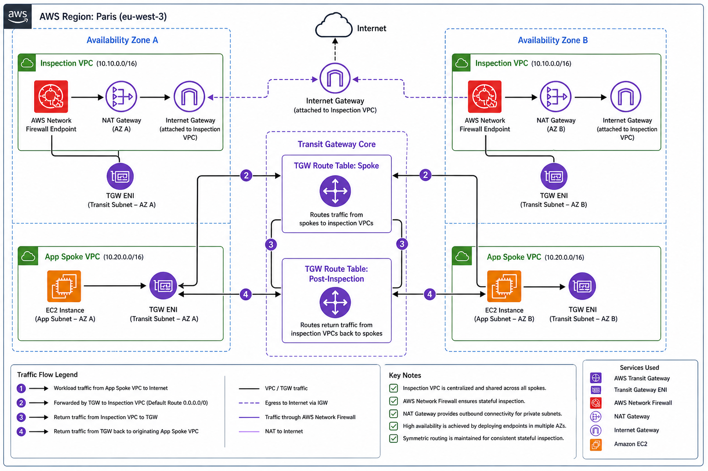
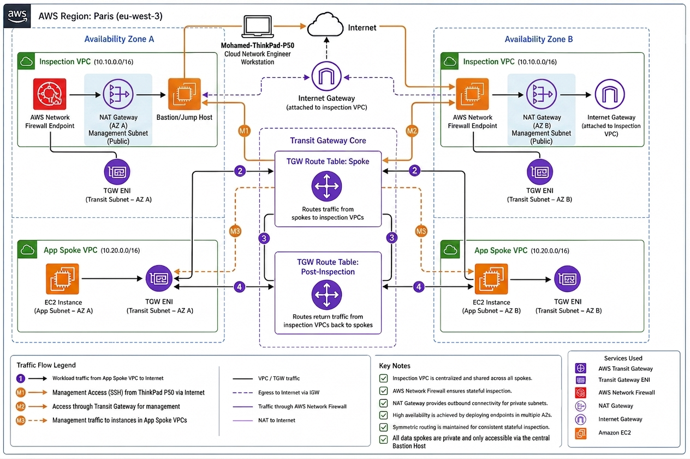

# AWS Hybrid Hub-and-Spoke Architecture

## Overview

This project implements a professional **Hub-and-Spoke** network topology in AWS using **Terraform**. It simulates a hybrid cloud environment where a central **Inspection Hub** manages traffic between multiple private **Spoke VPCs** and an on-premises data center.

---

# Hybrid Cloud Modernization: Secure Hub-and-Spoke Architecture

**Consultant:** Mohamed Hamidi  
**Status:** Production-Ready  
**Primary Region:** Paris (`eu-west-3`)  
**Disaster Recovery Region:** Frankfurt (`eu-central-1`)

---

## Architecture Components

### The Hub (Inspection VPC)
Centralized VPC containing:
- AWS Transit Gateway (TGW)
- Bastion Host
- Centralized inspection services
- Future-ready AWS Network Firewall integration

### The Spokes
- **Spoke A (Production):** Isolated production workload environment
- **Spoke B (Development):** Segmented development/testing environment

### Transit Gateway (TGW)
Acts as the central routing core ("network brain") connecting:
- VPCs
- VPN attachments
- On-premises infrastructure

### Security & Management
- **Bastion Host:** Secure administrative entry point
- **Security Groups:** Micro-segmentation and least-privilege access
- **Custom Route Tables:** Traffic inspection enforcement
- **Private Subnets:** No direct internet access for workloads

---

## Security Features

- No direct internet access for spoke workloads
- Centralized traffic inspection architecture
- Least-privilege security model
- SSH access restricted through Bastion Host
- Hybrid-ready VPN architecture
- Designed for AWS Network Firewall integration

---

## Tech Stack

- **Terraform** (Infrastructure as Code)
- **AWS**
  - VPC
  - Transit Gateway
  - EC2
  - Site-to-Site VPN
  - AWS Network Firewall
  - CloudWatch
  - AWS Backup
- **Linux**
  - Developed on ThinkPad P50

---

# Infrastructure Visualization

## A. Core Cloud Topology (Initial Design)



> Note: The management path (M1) represents the logical SSH session from the administrator workstation to the Bastion Host via the Internet Gateway.

---

## B. Core Cloud Topology (Updated Inspection Architecture)



This diagram illustrates the centralized inspection flow where all traffic between spokes and the internet is inspected by AWS Network Firewall.

---

## C. Hybrid Link Architecture (Connectivity)


This diagram details the secure Site-to-Site VPN connection and BGP route propagation between the Paris Data Center and AWS Transit Gateway.

---

# Technical Specifications

## Networking & Transit

### AWS Transit Gateway (TGW)
Central routing hub for:
- VPC attachments
- VPN attachments
- Inter-spoke communication

### Inspection VPC
Dedicated security VPC hosting:
- AWS Network Firewall
- NAT Gateways
- Inspection routing logic

### Site-to-Site VPN
- Dual IPsec tunnels
- AES-256 encryption
- Dynamic BGP routing
- Redundant hybrid connectivity

---

## Security & Governance

### Zero-Trust Architecture
All East-West and Egress traffic is inspected using:
- TGW Appliance Mode
- Centralized firewall policies

### FQDN Filtering
Stateful inspection allowing only:
- Approved corporate domains
- Authorized AWS endpoints

### IAM Governance
- MFA enforcement
- Role-based access control (RBAC)
- Service Control Policies (SCPs)

---

## Resilience & Observability

### Centralized Logging
- VPC Flow Logs
- AWS Network Firewall alerts
- CloudWatch Logs integration

### Disaster Recovery
- Automated AWS Backup
- Cross-region replication to Frankfurt (`eu-central-1`)
- Recovery Time Objective (RTO): 4 hours

---

# Infrastructure as Code (Terraform)

The project is modularized for enterprise-scale deployment.

## Repository Structure

```text
terraform/
├── modules/
│   ├── vpc/
│   ├── tgw/
│   ├── security/
│   └── dr/
│
├── environments/
│   ├── dev/
│   └── prod/
│
documentation/
└── diagrams/
    ├── Global_Topology.png
    ├── Global_Topology_Update.png
    └── Cloud_Onprem_Connection.png
```

---

## Terraform Modules

### `/modules/vpc`
- Multi-AZ VPC deployment
- Inspection and spoke VPCs
- Public/private subnet creation

### `/modules/tgw`
- Transit Gateway
- TGW route tables
- VPN attachments
- BGP configuration

### `/modules/security`
- AWS Network Firewall policies
- Security groups
- IAM roles and policies

### `/modules/dr`
- Backup plans
- Cross-region vault replication
- Disaster recovery automation

---

# Deployment Instructions

## Clone the Repository

```bash
git clone https://github.com/mhamidi80-cpu/aws-hybrid-hub-spoke-architecture.git
cd aws-hybrid-hub-spoke-architecture
```

## Initialize Terraform

```bash
terraform init
```

## Validate the Configuration

```bash
terraform validate
```

## Preview Infrastructure Changes

```bash
terraform plan
```

## Deploy Infrastructure

```bash
terraform apply
```

---

# Operations & Verification

## VPN Verification
- Confirm both IPsec tunnels are UP
- Validate BGP route propagation

## Firewall Validation
Attempt access to unauthorized domains:

```bash
curl http://unauthorized-domain.com
```

Expected result:
- Connection blocked by firewall policy

## Hybrid Connectivity Test

Verify routing between:
- AWS CIDR: `10.20.0.0/16`
- Paris Data Center CIDR: `192.168.0.0/16`

---

# Future Enhancements

- AWS Network Firewall TLS inspection
- AWS Organizations integration
- CI/CD with GitHub Actions
- Terraform Cloud remote state
- AWS Security Hub integration
- Multi-account landing zone architecture

---

# License

Licensed under the MIT License.

---

# Author

**Mohamed Hamidi**  
Cloud Infrastructure & Network Engineering Consultant

---

> All visual assets are property of Mohamed Hamidi Consulting and represent the final approved state of the Hybrid Modernization Program.
