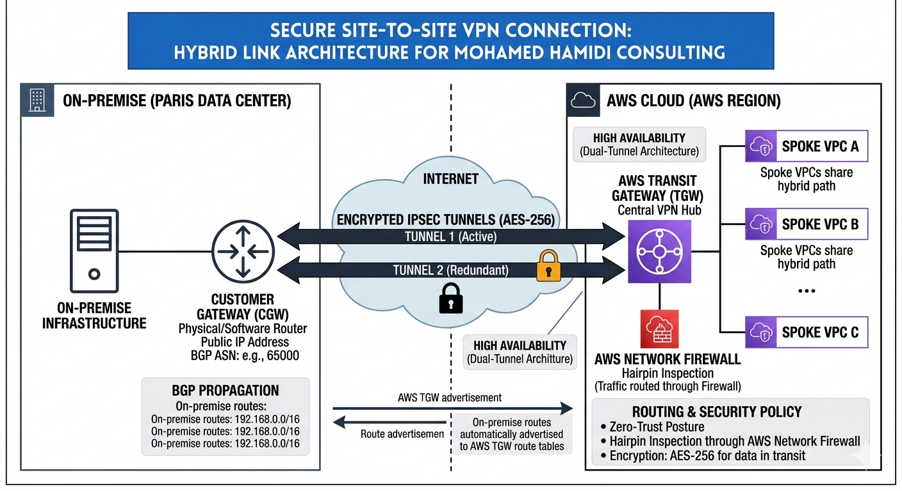

# AWS Hybrid Hub-and-Spoke Architecture

## Overview
This project implements a professional **Hub-and-Spoke** network topology in AWS using **Terraform**. It simulates a hybrid cloud environment where a central "Inspection" Hub manages traffic between multiple private "Spoke" VPCs and an on-premises data center.

## Architecture Components
- **The Hub (Inspection VPC):** Centralized VPC containing the Transit Gateway (TGW) and a secure Bastion Host.
- **The Spokes:** 
    - **Spoke A (Production):** Isolated workload environment.
    - **Spoke B (Development):** Segmented testing environment.
- **Transit Gateway (TGW):** The "Network Brain" routing traffic between VPCs and the VPN.
- **Security & Management:**
    - **Bastion Host:** Single, secure entry point for administrative SSH access.
    - **Security Groups:** Micro-segmentation allowing only specific web and management traffic.
    - **Route Tables:** Custom routing ensuring all inter-spoke traffic is inspected.

## Security Features
- **No Direct Internet Access:** All Spoke instances are in private subnets.
- **Least Privilege:** Security groups restrict SSH access specifically to the Bastion host.
- **Centralized Inspection:** Architecture is ready for AWS Network Firewall integration at the Hub.

## Tech Stack
- **Terraform** (Infrastructure as Code)
- **AWS** (VPC, TGW, EC2, VPN)
- **Linux** (Development on ThinkPad P50)

##  Topology

*Note: The management path (M1) represents the logical SSH session from the administrator workstation to the Bastion via the Internet Gateway.*

## How to Deploy
1. Clone the repo: `git clone https://github.com/mhamidi80-cpu/aws-hybrid-hub-spoke-architecture.git`
2. Initialize Terraform: `terraform init`
3. Plan the infrastructure: `terraform plan`
4. Apply changes: `terraform apply`

Hybrid Cloud Modernization: Secure Hub-and-Spoke Architecture

Consultant: Mohamed Hamidi

Status: Production-Ready

Region: Paris (eu-west-3) / DR: Frankfurt (eu-central-1)
1. Executive Summary

This project implements a highly secure, scalable, and resilient hybrid cloud infrastructure. The architecture transitions legacy on-premise workloads from a Paris Data Center into a modern AWS environment using a Centralized Inspection Hub-and-Spoke model.
2. Infrastructure Visualization
A. Core Cloud Topology (Egress & East-West)

This diagram illustrates the centralized inspection flow where all traffic between spokes and the internet is scrubbed by the AWS Network Firewall.
B. Hybrid Link Architecture (Connectivity)

This diagram details the secure Site-to-Site VPN connection and BGP propagation logic bridging the Paris Data Center with the AWS Transit Gateway.
3. Technical Specifications
Networking & Transit

    AWS Transit Gateway (TGW): Central hub for all VPC and VPN attachments.

    Inspection VPC: Dedicated security VPC hosting AWS Network Firewall and NAT Gateways.

    Site-to-Site VPN: Dual-tunnel IPsec (AES-256) providing redundant paths to on-premise infrastructure.

Security & Governance

    Zero-Trust Posture: Hairpin inspection for all traffic via TGW Appliance Mode.

    FQDN Filtering: Stateful firewall rules allowing only verified corporate and AWS domains.

    IAM Governance: Role-based access requiring MFA and Service Control Policies (SCPs) to prevent regional sprawl.

Resilience & Observability

    Centralized Logging: VPC Flow Logs and Firewall alerts consolidated in CloudWatch Logs.

    Disaster Recovery: Automated AWS Backup with cross-region replication to Frankfurt (eu-central-1) for a 4-hour RTO.

4. Infrastructure as Code (Terraform)

The project is modularized for enterprise deployment:

    /modules/vpc: Multi-AZ VPCs (Inspection & App Spokes).

    /modules/tgw: Transit Gateway, Route Tables, and VPN configurations.

    /modules/security: Network Firewall policies and IAM Roles.

    /modules/dr: Backup plans and cross-region vault replication.

5. Operations & Verification

Testing the Environment:

    VPN Check: Verify BGP status is up for both IPsec tunnels.

    Firewall Check: Attempt to curl an unauthorized domain (should be dropped).

    Hybrid Check: Ensure internal routing between 10.20.0.0/16 (AWS) and 192.168.0.0/16 (Paris) is active.

    Note: All visual assets are property of Mohamed Hamidi Consulting and represent the final approved state of the Hybrid Modernization Program.
